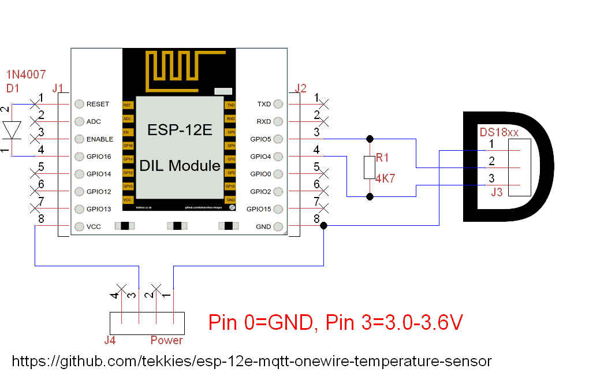

# esp-12e-mqtt-onewire-temperature-sensor
Low power ESP8266 MQTT OneWire Temperature Sensor using DS18B20

## ToDo
- [ ] Board: Increase gap between power and 1-wire headers
- [ ] Export state machine
- [_] Parallelize DS18x20 coversion when multiple devices

## Circuit 

## Board Layout

## Built by Standing on the Shoulders of These Giants
 - [OneWire](https://github.com/PaulStoffregen/OneWire) by [Paul Stoffregen](https://github.com/PaulStoffregen)
 - [arduino-mqtt](https://github.com/256dpi/arduino-mqtt)  by [Joël Gähwiler](https://github.com/256dpi)